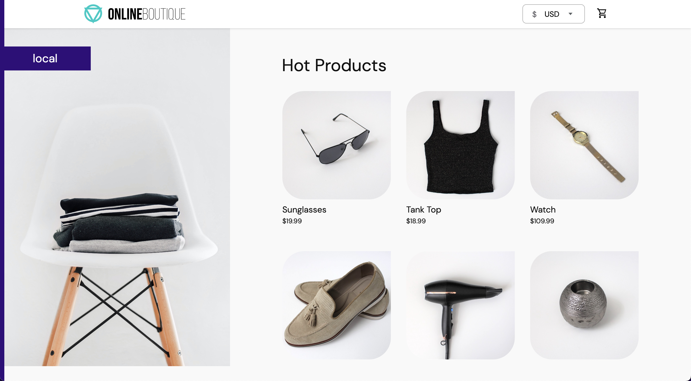

# Deploy-Microservices-Application-using-K8s

# Microservice Shop

This project implements Google's cloud-native microservices application by deploying the architecture using Kubernetes, Helm charts, and helmfile. The frontend can be externally accessed using a Kubernetes LoadBalancer.

## Features

- Created YAML file with 11 Deployment and corresponding Service manifests
- Created a Namespace and deployed all the micro services into it
- Configure more than 1 Replica for each Deployments for availability
- Pulls images from Google Cloud Container Registry and Docker Hub if necessary
- Monitors containers health with Liveness and Readiness Probes
- Configured Resource Requests and Resource Limits

## Prerequisites

Install kubectl (I used [minikube](https://github.com/kubernetes/minikube)), [Helm](https://github.com/helm/helm), and [Helmfile](https://github.com/roboll/helmfile).

- macOS: `brew install minikube helm helmfile`
- Windows: `choco install minikube kubernetes-helm kubernetes-helmfile`

## Installation

To get started, spin up a local Kubernetes cluster, or export the config of your cloud-based Kubernetes cluster to your OS path variable to get access with `kubectl`.

In the project directory, simply use `helmfile sync helmfile.yaml` to deploy all Kubernetes components into your K8s cluster.

Obtain the port that the application can be accessed with: `kubectl describe service/frontend | grep -i nodeport`

Access the microservices application with the port specified in your Kubernetes cluster and the public IP address provided by your Kubernetes Engine.

## Architecture

Microservices communication is achieved using API requests.

